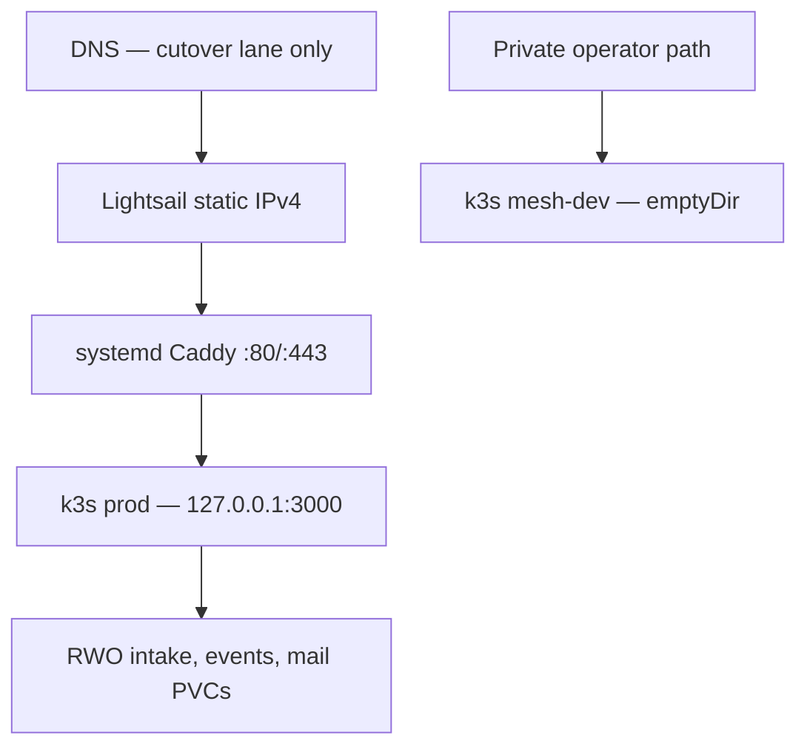

# AWS Lightsail migration architecture

Status: **planned candidate; not deployed**
Decision date: 2026-08-24
Product authority: **Public Exposure Review remains unchanged**

## Decision

Move the current private WitnessOps web host to one AWS Lightsail Ubuntu 24.04
instance in Frankfurt (`eu-central-1`) while preserving the existing runtime
boundary:



This is a host migration, not a greenfield platform change. The existing
`DEPLOY_SSH` seam, Caddy loopback edge, single-node k3s, one prod pod, mesh-dev
twin, three PVC mounts, two ordered Secret refs, and digest-qualified shared
image remain canonical.

The AWS migration contract is
[`../deploy/aws/migration-contract.v1.json`](../deploy/aws/migration-contract.v1.json).
Operational instructions and the fail-closed acceptance record are under
[`../deploy/aws/`](../deploy/aws/README.md).

## Authority and evidence classification

| Class | Statement | Evidence / disposition |
| --- | --- | --- |
| **FACT** | Current live repository authority is private Caddy → k3s with prod and mesh-dev. | `AGENTS.md`, `docs/DEPLOYMENT_AUTHORITY.md`, `docs/DEPLOYMENT_CUSTODY.md` |
| **FACT** | Prod is one replica using `Recreate`, UID/GID 1001, loopback hostPort 3000, and three RWO PVCs. | `deploy/k8s/deployment.yaml`, `deploy/k8s/pvc.yaml` |
| **FACT** | The deploy scripts already abstract the host through private `DEPLOY_SSH` and topology variables. | `deploy/topology.env.example`, `deploy/scripts/k3s-lib.sh` |
| **FACT** | Current smoke proves Secret-ref/image/runtime identity plus home HTTP/CSS parity, but it can call the public apex. | `deploy/scripts/k3s-lib.sh`; it is not safe candidate identity before DNS |
| **FACT** | Web runtime HMAC/session/OIDC secrets are not the Public Exposure Review Ed25519 production signing authority. | `apps/witnessops-web/src/lib/server/token-crypto.ts`, `admin-session.ts`, `public-exposure-review-verify-adapter.ts` |
| **FACT** | The current Public Exposure Review web trust snapshot is non-authorizing and allows no production key. | `apps/witnessops-web/src/lib/public-exposure-review-verify-adapter.ts` |
| **FACT** | No active AWS IaC, provider provisioning, backup/restore, data-copy, CloudWatch, or cutover implementation existed at this decision point. | Repository inventory at `6953794177e5e071874522c9a76071d26d0930d0` |
| **TARGET DECISION** | Use one 4 GiB / 2 vCPU / 80 GiB Lightsail instance, Ubuntu 24.04, static IPv4, Frankfurt. | Machine contract; later apply receipt must prove actual values |
| **TARGET DECISION** | Preserve single-writer filesystem semantics and archive Ask receipts/audits without remounting them. | Machine contract and migration runbook |
| **UNKNOWN** | Live PVC sizes/usage, StorageClass and encryption, Secret path values, Ask roots, DNS/Cloudflare state, Caddy bytes, backups, RPO/RTO, alarm ownership. | Must be resolved in restricted staging/cutover evidence; docs do not prove them |

The target bundle exists in the current Lightsail Linux plan catalog, Ubuntu 24
is a supported blueprint, and Frankfurt is a supported Lightsail region. AWS
documents static IPv4 attachment, independent IPv4/IPv6 firewalls, point-in-time
snapshots, and instance metric alarms. These provider capabilities do not prove
that any WitnessOps resource has been created or configured:

- [Lightsail regions and Availability Zones](https://docs.aws.amazon.com/lightsail/latest/userguide/understanding-regions-and-availability-zones-in-amazon-lightsail.html)
- [Lightsail instance blueprints](https://docs.aws.amazon.com/lightsail/latest/userguide/compare-options-choose-lightsail-instance-image.html)
- [Lightsail pricing and bundle dimensions](https://aws.amazon.com/lightsail/pricing/)
- [Create and attach a static IP](https://docs.aws.amazon.com/lightsail/latest/userguide/lightsail-create-static-ip.html)
- [Lightsail instance firewalls](https://docs.aws.amazon.com/lightsail/latest/userguide/understanding-firewall-and-port-mappings-in-amazon-lightsail.html)
- [Lightsail snapshots](https://docs.aws.amazon.com/lightsail/latest/userguide/understanding-snapshots-in-amazon-lightsail.html)
- [Lightsail instance metrics and alarms](https://docs.aws.amazon.com/lightsail/latest/userguide/amazon-lightsail-adding-instance-health-metric-alarms.html)

## Recommended integration boundary

AWS replaces only the current private host behind `DEPLOY_SSH`.

Adopt unchanged:

- Caddy as the host TLS/reverse-proxy process;
- loopback-only prod hostPort `127.0.0.1:3000`;
- one k3s node and one prod replica;
- mesh-dev private `hostNetwork` bind with `emptyDir` state;
- `/data/intake-store`, `/data/intake-events`, `/data/mail-out` mounts;
- ordered `BASE_ENV_SECRET`, then `ADMIN_OIDC_SECRET`;
- current k3s build/reconcile helpers and digest-qualified runtime identity;
- current product, pricing, request, `/verify`, and Public Exposure Review
  semantics.

Adapt for the migration:

- provider identity and firewall evidence;
- write-freeze, state manifests, backup/restore, and divergence-aware rollback;
- candidate-only pre-DNS acceptance that cannot observe the old apex;
- Lightsail metrics/alarms plus host/application signals;
- separate cutover receipt and DNS approval.

Defer:

- high availability, multiple nodes, managed databases, EFS/object-store state,
  EKS/ECS, ALB/CDN, Route 53, or Terraform;
- signed-GHCR artifact import into the private k3s runtime;
- durable Ask receipt storage and any wider Ask/API/public app launch;
- production Ed25519 signing custody and key-registry activation.

Reject in this phase:

- copying historical Docker Compose or retired Azure deployment paths;
- treating AWS creation, an HTTP 200, a snapshot timestamp, or an image tag as
  proof of a successful migration;
- storing AWS credentials, runtime secrets, customer state, signing keys, or
  completed receipts in Git;
- activating production receipt trust as part of the deployment or cutover.

## GitHub deployment source contract (Phase 1; not active)

Phase 1 adds a reviewed source boundary for a later GitHub-to-AWS release path:

```text
main commit
-> GitHub OIDC short-lived role
-> immutable ECR manifest
-> lane-specific SSM document
-> fixed root-owned host adapter
-> existing k3s reconciliation and smoke boundary
```

The machine contract is
[`../deploy/aws/github-deployment-contract.v1.json`](../deploy/aws/github-deployment-contract.v1.json)
and the parameterized CloudFormation source is
[`../deploy/aws/cloudformation/github-deployment-bootstrap.template.json`](../deploy/aws/cloudformation/github-deployment-bootstrap.template.json).
Neither is active infrastructure or deploy authority.

The trust is split across an exact-repository image publisher, staging deployer,
and production deployer. Each checks the `sts.amazonaws.com` audience, immutable
owner/repository subject, repository and owner IDs, `refs/heads/main`, an exact
GitHub Environment, and the reserved reusable workflow at
`.github/workflows/aws-release-reusable.yml@refs/heads/main`. The reusable
workflow is absent in Phase 1, preventing unrelated workflows from assuming the
roles. Production additionally requires a protected GitHub Environment
reviewer. OIDC eliminates stored AWS access keys; it does not eliminate the
production authorization gate.

The template reuses an operator-supplied account-level GitHub OIDC provider ARN,
creates no provider or activation credential, and creates no Lightsail instance,
DNS, Secret, KMS signing key, or production key-registry resource. Its ECR
repository name and Run Command retention are fixed, and the repository is
immutable and retained. Its two SSM documents accept only bounded identity
inputs and call `/usr/local/sbin/witnessops-deploy-v1`; arbitrary command text is
not an input. Registry-level ECR scan configuration is observed, not overwritten,
and acceptance requires digests for the observed configuration and findings plus
an explicit passing policy result. The host adapter and GitHub workflows are
explicitly Phase 3 deliverables and are absent in Phase 1.

Lightsail is registered later as a Systems Manager hybrid managed node. The
host-side service role may pull only the exact ECR repository and write the exact
Run Command log group. The web pod receives no AWS credentials. Managed-node
stage tags and separate documents prevent a staging role from targeting the
production stage and vice versa.

Staging acceptance must record the GitHub run/attempt, reusable workflow ref,
OIDC subject/audience, the CloudFormation staging-role output, the assumed AWS
role/session and STS principal, ECR repository/digest, observed scan
configuration/findings/policy result, SSM node/document version/document
digest/command ID/status, CloudWatch log group, host-adapter digest, requested
image, and observed prod/mesh runtime identities. The role, STS, repository,
image, and CloudFormation output must use the recorded target AWS account, and
both runtime identities must equal the manifest-bound config digest. Missing or
mismatched trust and artifact inputs block readiness; they are not inferred from
an HTTP 200.

## Compute

The target is one Lightsail Linux instance with:

- Ubuntu 24.04 and IMDSv2 candidate identity checks;
- 4 GiB RAM, 2 vCPU, and an 80 GiB system disk;
- Docker available for the existing private build path;
- k3s using its local storage provisioner unless staging evidence identifies a
  different explicit StorageClass;
- Caddy under systemd;
- one production pod with current resource requests/limits and `Recreate`;
- at least 20 GiB free system disk after images and state are present.

This preserves behavior but is not highly available. The instance, k3s control
plane, container runtime, Caddy, and local PVCs share one failure domain.
Lightsail snapshots are recovery artifacts, not synchronous replicas.

The 4 GiB target must successfully perform the actual Node 22 image build or the
build must move to a separately authorized builder/import lane. A theoretical
bundle dimension is not proof that the Next.js build, image import, and running
pod fit under load.

## Edge and networking

The later apply lane must configure both provider and guest boundaries:

| Layer | Required state |
| --- | --- |
| Lightsail IPv4 | Static IPv4 attached to the exact candidate instance |
| Lightsail firewall | TCP 80/443 from the internet; TCP 22 only from the custodied operator source; no public 3000/3001/k3s ports |
| IPv6 | Disabled for this phase; no AAAA record or independent IPv6 firewall exposure |
| Guest firewall | Mirrors the intended public and operator surface; denies internal app/k3s ports publicly |
| Caddy | Full active config validates; apex/`www` route to `127.0.0.1:3000`; unrelated private host blocks are not copied accidentally |
| Prod app | Listens only on `127.0.0.1:3000` |
| Mesh-dev | Binds only to the injected private address and is never public DNS/Caddy |

DNS and Cloudflare remain separate authority. This PR does not determine live
proxy mode, TTLs, current record values, or certificate state. The restricted
cutover receipt must capture them before any write and preserve the legacy
`docs.witnessops.com` redirect path.

The edge migration is parity-only. It must not widen `/api`, `/admin`, `/mcp`,
OffSec, or unfinished app surfaces. Compare old and candidate path/status/header
dispositions before cutover and fail on unexpected exposure.

## Persistent state migration

### Current code truth

- Intake and issuance JSON files are read models; the append-only admission
  event ledger is reconstruction authority.
- Verification contexts and admin `core-state.json` are stored under the intake
  mount. Admin core can initialize empty if the file is missed, so HTTP success
  can conceal data loss.
- Event, retry, queue, and token-audit files share filesystem-backed custody.
- Ask receipts and Ask audit roots default to container-working-directory paths
  unless private runtime configuration overrides them; active manifests do not
  mount them explicitly.
- The production manifests mount `/data/*`. Private Secret values must be
  inspected because repository examples have historically used different
  `/persistent/*` paths.
- Mail-out is a staging/output surface, not a queue that may be blindly replayed.

### Migration classes

| Store | Decision | Why |
| --- | --- | --- |
| Intake store | Copy and manifest-verify, excluding transient lock/temp files | Carries customer intake, issuances, contexts, and admin core |
| Intake events | Copy and manifest-verify during the same freeze | Carries authoritative/reconstructable history and retry/audit records |
| Mail-out | Archive source; create target empty | Prevents accidental resend/replay while preserving restricted recovery evidence |
| Ask receipts | Discover and archive; do not mount | Current durability is under-wired and not part of the Public Exposure Review customer path |
| Ask audits | Discover and archive; do not mount | Same custody boundary as Ask receipts; no new durability claim |

The copy uses a pre-copy followed by a short, approved write freeze and final
delta. Source and target manifests record sorted relative paths, per-file
SHA-256, aggregate manifest SHA-256, counts, bytes, UID/GID, and modes. Reject
symlinks, devices, sockets, partial NDJSON, source drift during final hashing,
permission mismatch, silent empty admin core, or projection divergence.

Do not copy active lock files. Do not expose customer filenames or hashes in the
public PR. Do not stage customer state on an uncontrolled operator workstation.

### Backup and restore

Before cutover:

1. prove a current encrypted source backup;
2. enable/record target snapshot settings;
3. restore into an isolated candidate or replacement instance;
4. mount with UID/GID 1001 and load the application;
5. parse ledgers, load admin core, reconstruct projections, and verify manifests;
6. record elapsed restore time against approved RPO/RTO.

A snapshot that exists but has not been restored is not accepted recovery
evidence.

## Secrets and signing custody

### Web runtime secrets

The migration carries the existing two-Secret runtime contract. It may rotate
admin session, Google OIDC, mail-provider, and token HMAC credentials through a
separately authorized operator step. The pod receives key/value pairs from
preprovisioned Kubernetes Secrets; no AWS access keys are injected into the web
workload.

`WITNESSOPS_TOKEN_SIGNING_SECRET` requires special handling. Existing token and
verification-context digests depend on it, so rotation requires an inventory of
nonterminal records and an explicit invalidation/reissue or compatibility
decision. Rotation that silently strands an active request is a migration
failure.

### Production receipt signing

Production Public Exposure Review signing is a different trust boundary:

- no Ed25519 production private key on the Lightsail host or web pod;
- no signing key in either Kubernetes Secret;
- no web-workload KMS signing permission;
- no allowlisted production key, active-registry transition, trusted revision,
  registry hash, or custody approval change in this PR;
- no change to `/verify` trust posture as a side effect of hosting.

The migration record requires equal pre/post trust-policy digests and explicit
`false` values for key activation, key-registry change, and private key presence.
A later production-key PR must define and approve registry acceptance, private
key custody, rotation, revocation, time validity, policy pinning, and verifier
distribution independently.

## Immutable image provenance

Current production authority remains the private local-k3s build until a
separate activation lane completes. The Phase 1 GitHub/ECR material is source
only and cannot be cited as evidence that an ECR artifact was published or
deployed.

For the planned GitHub/ECR candidate, provenance means:

- full clean Git source SHA;
- GitHub run ID/attempt and the exact main-branch source SHA;
- observed immutable OIDC subject/audience, reserved reusable-workflow ref, and
  the STS role/session identity;
- Supply Chain Gate result hash;
- digest-qualified Node 22 base image;
- pinned Google Workspace CLI version/archive hash;
- exact ECR repository ARN, one human alias, the application OCI manifest digest,
  and digests of the observed scan configuration and findings with its policy result;
- manifest-bound config digest;
- SSM managed-node ID, document name/version/content digest, command ID/status,
  CloudWatch log group, and root-owned adapter digest;
- identical prod/mesh pod spec refs and observed runtime image IDs.

The active private build still imports a locally built image into k3s. Phase 1
does not add a workflow or host adapter and therefore makes no ECR, cosign, SBOM,
or deployed-artifact claim. Phase 3 must import the exact ECR manifest into local
k3s containerd without placing AWS credentials in the web pod, then reconcile
and observe the same digest in both runtime lanes.

## Staging acceptance

The candidate is deployed and inspected before DNS in a separately authorized
staging lane. The new `deploy/aws/candidate-acceptance.sh` requires explicit
instance, AZ, static-IP, SSH, image, and config-digest expectations. It uses
IMDSv2 and candidate-local/private HTTP, never the public apex.

Required staging evidence:

1. Node 22 `pnpm health` and 144/144 k3s contract tests.
2. Actual bundle capacity, disk headroom, services, pod readiness, PVC binding,
   mount access, and `DiskPressure=false`.
3. Full Caddy validation, loopback and exact non-wildcard custodied mesh binds,
   exact candidate-local apex/`www`/legacy-docs status and redirect locations,
   provider/guest firewall review, and path-disposition parity.
4. Exact two-Secret key-name/order/path preflight plus both deployments'
   explicit environment names without value disclosure.
5. Same digest-qualified image and manifest/config/runtime identity in both
   lanes.
6. Candidate-local routes for home, request, verify, security, and support.
7. GitHub OIDC deployment identity: run/attempt, immutable claims, reserved
   reusable workflow, CloudFormation staging-role output, exact assumed role and
   STS principal, target-account binding, ECR digest and scan-policy evidence,
   SSM node/document/command, adapter digest, logs, and manifest-bound runtime
   config digests.
8. Public Exposure Review receipt-only behavior:
   - recognized profile → `indeterminate`;
   - malformed profile → `invalid`;
   - same-shape signature mutation while crypto/trust is unchecked →
     `indeterminate` with `receipt_signature_cryptographic=not_checked`.
9. State manifests, admin-core load, NDJSON parse, and projection reconstruction.
10. Isolated backup restore.
11. Alarm notification fire/recovery and known-good image/state rollback rehearsal.

The checked-in example remains `not_run` and cutover-unauthorized. The validator
fails closed on incomplete gates, mutable images, manifest mismatches, trust
changes, missing rollback, or missing observability ownership.

## Observability

Use the smallest useful stack for this single-node phase:

- Lightsail instance status, CPU, and network metrics with verified notification
  contact and tested alarms;
- systemd journals for Caddy and k3s with recorded retention/redaction;
- Kubernetes readiness, restarts, runtime identity, PVC use, disk free space,
  and DiskPressure;
- app logs for storage, ledger, mail-provider, upstream, and rate-limit errors;
- an external post-cutover route probe.

No existing repository code proves SLOs, distributed tracing, CloudWatch Logs,
or a dashboard. Those are not claimed. An operator owns every cutover alarm and
records its runbook/escalation reference.

## Rollback and data divergence

Rollback has three different cases:

| Failure point | Safe action |
| --- | --- |
| Before AWS accepts any write | Restore prior DNS to the retained old host and verify it |
| After AWS accepts a write | Freeze writes; reverse-sync/reconcile AWS state before restoring old host, or repair forward on AWS |
| Image-only failure with compatible state | Deploy the same known-good digest to both prod and mesh-dev, then run pair smoke |

The last simple rollback point is immediately before AWS becomes the writer. DNS
alone cannot merge divergent filesystem state. Keep the old host until a
separate decommission approval after the observation window, reconciliation,
and backup confirmation.

Abort on state/hash/projection mismatch, wrong mounts or permissions, unexpected
public exposure, mutable/mismatched images, Secret preflight failure, verifier
overclaim, unhealthy services, missing alarm owner, or unready rollback target.

## Cutover

Cutover is a future, separately authorized sequence:

1. Capture current DNS, TTL/proxy state, Caddy checksum, source image/state, and
   callback/webhook dependencies.
2. Approve RPO, RTO, maintenance window, abort thresholds, and exact rollback
   values.
3. Complete backups, restore rehearsal, staging acceptance, and old-host check.
4. Pre-copy state.
5. Freeze source writes and complete the final consistency-point copy.
6. Reconcile manifests/projections and rerun candidate-local acceptance.
7. Obtain separate DNS/cutover approval.
8. Change only the approved apex and `www` records; preserve docs redirect
   reachability.
9. Verify external TLS, canonical redirects, buyer routes, request intake,
   verifier semantics, logs, and alerts from independent observers.
10. Observe, then explicitly close or roll back. Do not decommission the old
    host and do not activate production signing trust during this step.

## Risks and next decisions

| Risk | Treatment in this phase |
| --- | --- |
| Single point of failure | Accepted migration constraint; snapshots, alarms, retained old host, rehearsed restore |
| Three PVCs lack transactional snapshot | One writer; write freeze; final copy and cross-store manifest/projection gate |
| Admin core can silently initialize empty | Explicit nonempty/source parity and application-load check |
| Token HMAC rotation can invalidate live flows | Inventory and approved invalidate/reissue or compatibility plan |
| Ask persistence is under-wired | Archive-only, no remount, no durability/public-launch claim |
| Pre-DNS smoke can observe old apex | Explicit IMDSv2 candidate identity and local/private candidate helper |
| Local image is not proven equal to signed GHCR artifact | Record immutable local identity and limitation; defer signed artifact import |
| Rollback after new writes can lose data | Freeze and reverse-sync/reconcile before DNS rollback |
| DNS/Caddy/secret values are private/unknown | Resolve and evidence in restricted apply/cutover receipt |

Next phase after this PR is reviewed requires the operator MacBook checkout (or
approved AWS CloudShell): reuse the account-level OIDC provider, apply the
reviewed template, configure immutable GitHub OIDC subjects and protected
Environments, and hybrid-register the non-public candidate. Stop before adapter
installation, workflow activation, application deployment, or DNS. A subsequent
Phase 3 PR implements the bounded adapter and workflow using the observed
non-secret resource identifiers. Production-key activation remains independent
regardless of AWS readiness.
